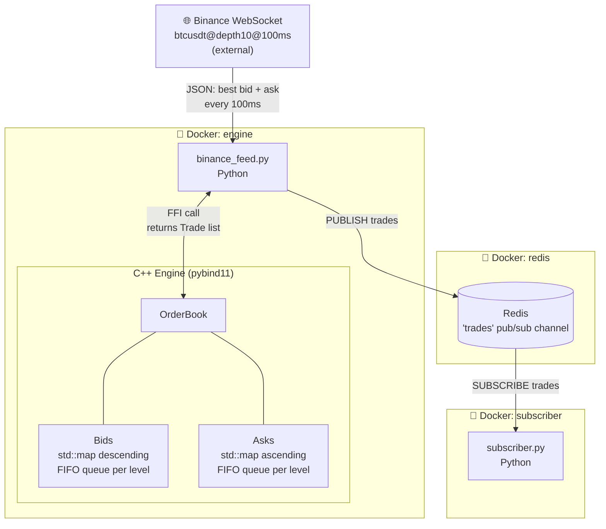

# Low-Latency Order Book Engine

A high-performance order book matching engine built in C++, with Redis pub/sub for real-time trade distribution, Python bindings for strategy development, and live Binance market data integration.

## Project Status

| Phase | Description | Status |
|-------|-------------|--------|
| 1 | Core C++ Engine + Tests + CI | ✅ Complete |
| 2 | Redis Integration | ✅ Complete |
| 3 | Python Bindings + Live Market Data | ✅ Complete |
| 4 | Docker + Backtesting + Strategy | 🔄 In Progress |

See [PLAN.md](PLAN.md) for detailed progress tracking.

## What's Built

- **Price-time priority matching engine** — O(log n) add, O(1) cancel
- **Order types** — Limit and Market orders
- **Unit tests** — GoogleTest suite covering all core operations
- **Benchmarks** — Google Benchmark measuring real latency
- **Redis pub/sub** — C++ engine publishes trades to a Redis channel in real time
- **pybind11 bindings** — call the C++ engine directly from Python
- **Binance WebSocket feed** — streams live BTCUSDT order book data into the C++ engine every 100ms
- **End-to-end trade pipeline** — Binance → Python → C++ engine → Redis → subscriber
- **Docker Compose** — `docker compose up` runs the full pipeline, no local setup needed
- **GitHub Actions CI** — builds and tests on every push (GCC + Clang, Debug + Release)

## Architecture

### System Pipeline



### Order Book Internals

When a new order arrives, the engine checks if it crosses the opposite side. If bid ≥ ask, a trade is generated at the resting order's price (price-time priority).

```
                    ORDER BOOK: BTCUSDT
    ┌──────────────────────────────────────────────┐
    │               ASKS  (sell orders)            │
    │                                              │
    │  Price        Queue (FIFO → oldest first)    │
    │  68,140.00  [ 750 ]──[ 300 ]                 │
    │  68,139.00  [ 200 ]                          │
    │  68,138.00  [ 500 ]──[ 1000 ]  ← best ask   │
    ├──────────────────────────────────────────────┤
    │           spread = $0.01                     │
    ├──────────────────────────────────────────────┤
    │               BIDS  (buy orders)             │
    │                                              │
    │  68,137.99  [ 800 ]──[ 400 ]   ← best bid   │
    │  68,137.00  [ 600 ]                          │
    │  68,136.00  [ 1200 ]                         │
    └──────────────────────────────────────────────┘

    New BUY @ 68,138.00 → crosses best ask → MATCH
    Trade: price=68138.00, qty=min(incoming, resting)
    → published to Redis "trades" channel
```

### Complexity

| Operation | Complexity | Data Structure |
|-----------|-----------|----------------|
| Add order | O(log n) | `std::map` insert |
| Cancel order | O(1) | `std::unordered_map` id → iterator |
| Match order | O(k) | Walk price levels until filled (k = levels crossed) |
| Best bid/ask | O(1) | `std::map::rbegin` / `begin` |

## Benchmark Results

| Operation | Latency | Throughput |
|-----------|---------|------------|
| Add order | 0.14 µs | 7M orders/sec |
| Cancel order | 0.13 µs | 8M orders/sec |
| Match order | 0.22 µs | 4.5M orders/sec |
| Best bid/ask query | 2.6 ns | 390M queries/sec |

## Project Structure

```
OrderBookEngine/
├── PLAN.md                     # Master plan and progress tracker
├── docker-compose.yml          # Runs Redis + engine + subscriber
├── Dockerfile.engine           # C++ build + Binance feed container
├── Dockerfile.subscriber       # Python subscriber container
├── docs/
│   ├── ARCHITECTURE.md         # Data structures and design rationale
│   └── GLOSSARY.md             # Trading terminology explained
├── cpp/
│   ├── CMakeLists.txt          # Build configuration (FetchContent for all deps)
│   ├── include/                # Header files (.hpp)
│   ├── src/                    # Implementation files (.cpp)
│   ├── bindings/               # pybind11 Python bindings
│   ├── tests/                  # GoogleTest unit tests
│   └── benchmarks/             # Google Benchmark latency tests
└── python/
    ├── binance_feed.py          # WebSocket → C++ engine → Redis
    ├── subscriber.py            # Redis trade subscriber
    └── requirements.txt
```

## Running with Docker (Recommended)

No dependencies to install — Docker handles everything.

```bash
docker compose up
```

This starts:
1. **Redis** — message broker
2. **Engine** — builds C++ engine, streams Binance data, publishes trades
3. **Subscriber** — prints matched trades from Redis

```bash
docker compose down   # stop all containers
docker compose build  # rebuild after C++ changes
```

## Running Locally

**Prerequisites:** CMake 3.16+, C++17 compiler, Python 3.12, Redis

```bash
# 1. Build the C++ engine
cd cpp
cmake -B build -DCMAKE_BUILD_TYPE=Release \
      -DBUILD_TESTS=OFF -DBUILD_BENCHMARKS=OFF \
      -DPython3_EXECUTABLE=/opt/homebrew/bin/python3.12
cmake --build build --parallel
cd ..

# 2. Set up Python environment
/opt/homebrew/bin/python3.12 -m venv .venv
source .venv/bin/activate
pip install -r python/requirements.txt

# 3. Start Redis
redis-server

# 4. In separate terminals:
python python/subscriber.py       # terminal 1: listen for trades
python python/binance_feed.py     # terminal 2: stream live data
```

## Running the C++ Demo (Redis pub/sub only)

```bash
redis-cli SUBSCRIBE trades        # terminal 1
./cpp/build/orderbook_demo        # terminal 2
```

The C++ demo adds two crossing orders, they match, and the trade appears in the subscriber terminal.

## Running Tests and Benchmarks

```bash
# Build with tests and benchmarks enabled
cmake -B cpp/build -DCMAKE_BUILD_TYPE=Release -DPython3_EXECUTABLE=/opt/homebrew/bin/python3.12
cmake --build cpp/build --parallel

# Run tests
./cpp/build/orderbook_tests

# Run benchmarks
./cpp/build/latency_benchmark
```

## Documentation

- [Architecture](docs/ARCHITECTURE.md) - Design decisions and data structures
- [Glossary](docs/GLOSSARY.md) - Trading terms explained
- [Plan](PLAN.md) - Full roadmap and progress tracker

## License

MIT
